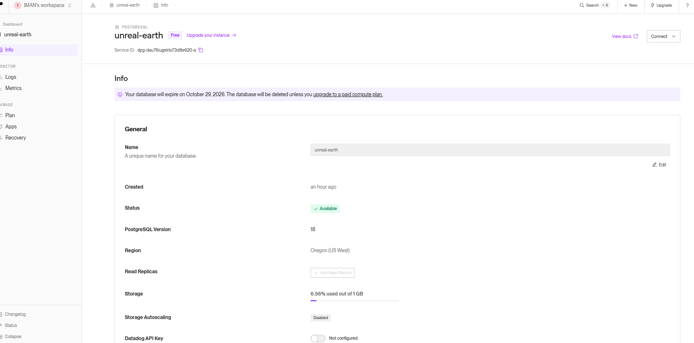
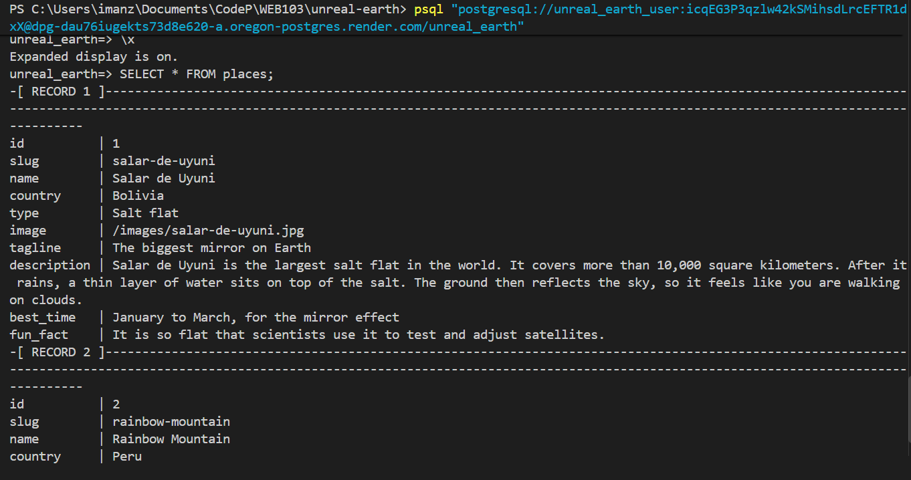
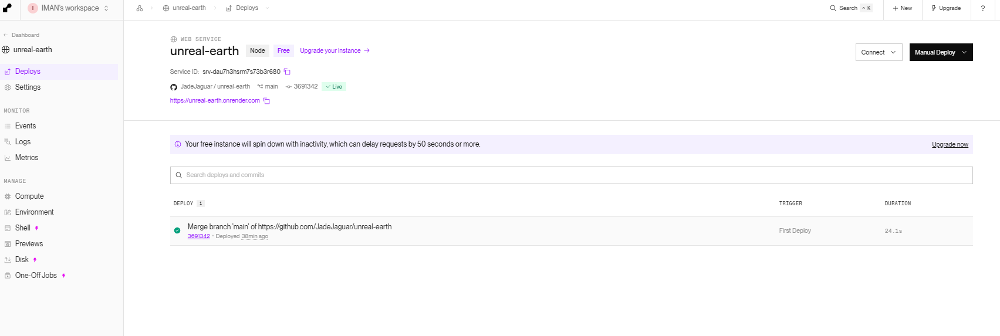

# WEB103 Project 2 - *Unreal Earth*

Submitted by: **Iman Zahid**

About this web app: **Unreal Earth is a list of real places on our planet that look like they belong on another world. Users can browse eight amazing places, like a pink lake, a rainbow striped mountain and a salt flat that turns into a giant mirror, and search for them by name, country or type. Clicking a place opens its own page with a big photo, the country, the type of landscape, the best time to visit, a description and a fun fact. The place data now lives in a PostgreSQL database hosted on Render, and the whole app is deployed live on Render.**

Time spent: **5** hours

## Required Features

The following **required** functionality is completed:

<!-- Make sure to check off completed functionality below -->
- [x] **The web app uses only HTML, CSS, and JavaScript without a frontend framework**
- [x] **The web app is connected to a PostgreSQL database, with an appropriately structured database table for the list items**
  - [x] **NOTE: Your walkthrough added to the README must include a view of your Render dashboard demonstrating that your Postgres database is available**

    
  - [x] **NOTE: Your walkthrough added to the README must include a demonstration of your table contents. Use the psql command 'SELECT * FROM tablename;' to display your table contents.**

    

The following **optional** features are implemented:

- [x] The user can search for items by a specific attribute (name, country or type). Search is case-insensitive and updates the card grid live, with a message showing how many places matched, or a friendly "no matches" message when nothing does.

The following **additional** features are implemented:

- [x] A dedicated JSON API (`/api/places`, `/api/places/:slug`) is kept separate from the HTML page routes (`/places/:slug`), so it's obvious which URLs return data and which return pages.
- [x] The detail page fetches only the single place it needs (`/api/places/:slug`) instead of downloading the whole list and filtering client-side, and a real 404 is returned by the server (not just a client-side redirect) when a slug doesn't exist.
- [x] Both client-side `fetch` calls are wrapped in error handling, so a failed request or an API outage shows a friendly message instead of a blank page or a console error.
- [x] The database connection uses environment variables (never committed to Git) and `npm run reset` seeds the table from `server/data/places.js`, so the schema and data can be rebuilt from scratch at any time.
- [x] Build output (`server/public`) is generated by Vite and gitignored instead of committed, keeping one source of truth for the client code.
- [x] The app is deployed live on Render at [unreal-earth.onrender.com](https://unreal-earth.onrender.com), with a custom build command that builds the client and serves it from the same Express server that talks to the database.

  
